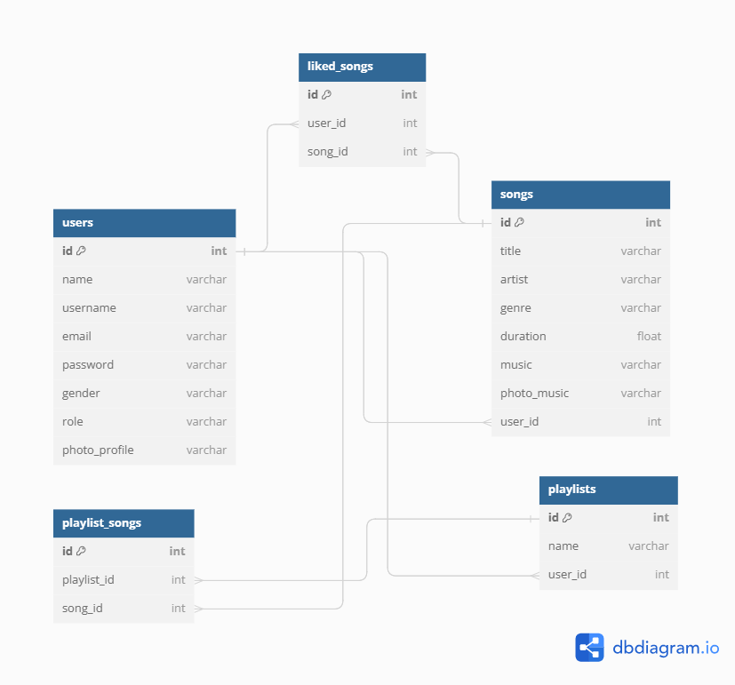

# L3NMusicStreaming

## 📑 About the Project
L3NMusicStreaming adalah platform streaming musik yang dirancang untuk memberikan pengalaman mendengarkan musik yang luar biasa bagi penggunanya. Proyek ini dibuat dengan tujuan untuk memudahkan pengguna dalam menemukan dan menikmati musik favorit mereka.

## 🖼 Prototype
- [FIGMA](https://www.figma.com/file/OXANzvyeSg6enWdllMqRUo/Musike---Music-Streaming-Mobile-App-(Community)?type=design&node-id=0-1&mode=design&t=u5uuwSd2GTs0KXHJ-0)
### ⚙ Backend
- [Swagger OpenAPI](https://app.swaggerhub.com/apis-docs/L3NONEONE_1/l3nmusicstreaming/1.0.0#/)

## 🔮 Fitur

- 👤 **Autentikasi dan Manajemen User**
    - Registrasi User
    - Login User
    - Mendapatkan Detail User
    - Memperbarui Akun User
    - Memperbarui Sandi User
    - Menghapus User
- 🎵 **Manajemen Musik**
    - Membuat Musik
    - Mendapatkan Semua Musik
    - Menambahkan Lagu yang Disukai Atau Menghapus Lagu Yang Disukai
    - Mendapatkan Lagu yang Disukai
    - Mencari Musik
- 📋 **Manajemen Playlist**
    - Membuat Playlist
    - Menambahkan Lagu ke Playlist
    - Mendapatkan Playlist Pengguna
    - Menghapus Playlist
    - Mendapatkan Lagu dalam Playlist
    - Menghapus Lagu dari Playlist

## Daftar Endpoint

| Tag | Endpoint |
| --- | --- |
|👤User | `POST /login` |
|👤User | `POST /users` |
|👤User | `GET /users` |
|👤User | `PUT /users` |
|👤User | `DELETE /users` |
|👤User | `PUT /change-password` |
|🎵Music | `POST /music` |
|🎵Music | `GET /music` |
|🎵Music | `POST /music/liked/:song_id` |
|🎵Music | `GET /music/liked` |
|🎵Music | `GET /music/search` |
|📋Playlist | `POST /playlist` |
|📋Playlist | `POST /playlist/:song_id` |
|📋Playlist | `GET /playlist` |
|📋Playlist | `DELETE /playlist/:playlist_id` |
|📋Playlist | `GET /music/playlist/:playlist_id` |
|📋Playlist | `DELETE /music/playlist/:playlist_id/song/:song_id` |

## 🗺️ ERD


## ✔️ Unit Testing

## 🛠️ Teknologi Stack

- **Golang**: Bahasa pemrograman yang digunakan untuk mengembangkan backend aplikasi.
- **GORM**: Object-Relational Mapping (ORM) library untuk Golang.
- **PostgreSQL**: Sistem manajemen basis data relasional.
- **Amazon S3**: Layanan penyimpanan objek yang menawarkan skalabilitas, perlindungan data, dan kinerja.
- **Amazon RDS**: Layanan penyimpanan database yang menawarkan skalabilitas, perlindungan data, dan kinerja.
- **JWT**: JSON Web Token untuk mengamankan pertukaran data.
- **AWS**: Amazon Web Services, platform cloud yang menawarkan berbagai layanan infrastruktur IT.
- **Docker**: Platform yang memungkinkan pengembang untuk membangun, mengemas, dan mendistribusikan aplikasi dengan mudah.


## ✔️ Requirement
Things you need to run the KosKita API
1. **AWS Account**

## 🧰 Installation
Follow these steps to install and set up the KosKita API:
1. **Clone the repository:**

   ```bash
   git clone https://github.com/lendral3n/SoloProject-L3NMusicStreaming.git
   
2. **Move to Cloned Repository Folder**

    ```bash
    cd SoloProject-L3NMusicStreaming
    
3. **Update dependecies**
    
    ```bash
    go mod tidy

4. **Create a database** 

5. **Copy `local.env.example` to `local.env`**

    ```bash
    cp local.env.example local.env
    
6. **Configure your `local.env` to configure JWT token, connect to your database, AWS Account**
7. **Run L3NMusicStreaming API** 
8. 
    ```bash
    go run .

## 🤖 Author

- **Lendra Syaputra** - BE 20 ALTA
  - [Github](https://github.com/lendral3n)